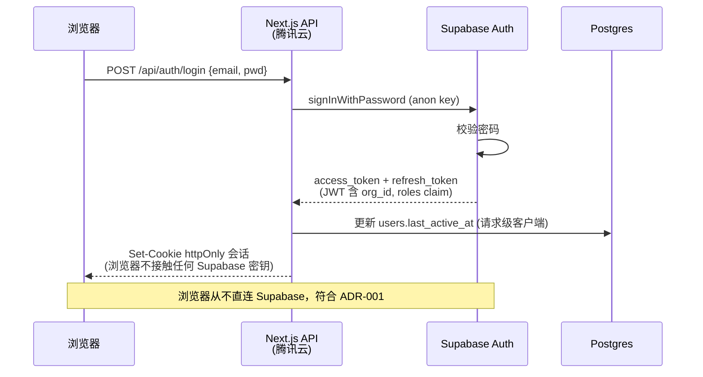
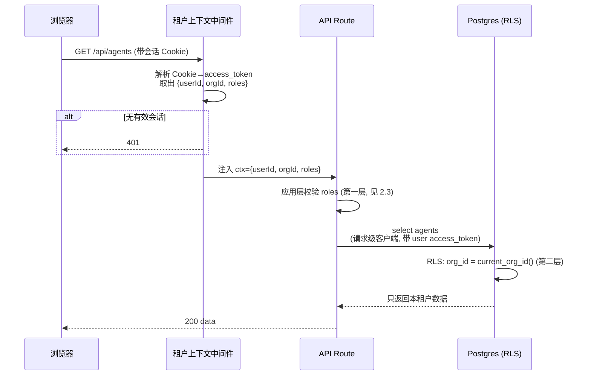

# ADR-002：认证、租户上下文传递与 RLS 隔离策略

- 状态：**待拍板**（2026-07-19 起草，冲刺 D1·D-1；需 Perry 午间拍板）
- 对应任务：ROADMAP 2.2（认证与多租户方案），承接 ADR-001「多租户隔离方案（原则）」
- 决策人：Perry
- 起草：Claude
- 依赖：2.1（ADR-001，已采纳）、2.4（数据模型 v1.0，16 表 + migration 0001 已落库）

---

## 背景与要解决的核心矛盾

ADR-001 定了两条看似冲突的铁律：

1. **双层防护**：数据库 RLS（按 `org_id`）+ 应用层 API 中间件，单层失误不泄数据。
2. **浏览器永不直连 Supabase**：所有请求先到自己的 Next.js（腾讯云 43.173.99.218），服务端再访问 Supabase，密钥 `SUPABASE_SERVICE_ROLE_KEY` 只在服务器。

矛盾在于：**`service_role` 密钥会绕过所有 RLS**。若服务端一律用 `service_role` 访问 Supabase，migration 0001 里那套 `current_org_id()` RLS 策略形同虚设，"双层"退化为"单层（只剩应用层）"。同时 `current_org_id()` 依赖 `auth.uid()`，而 `service_role` 连接下 `auth.uid()` 为 NULL，策略直接失效。

ADR-002 的任务：定死**认证方式**、**租户上下文从浏览器到数据库的完整传递链路**、以及**在"浏览器不直连 + 双层防护"约束下 RLS 如何真正生效**。

---

## 决策

### 1. 认证：Supabase Auth + 服务端会话（首版邮箱密码）

- 认证提供方 = **Supabase Auth**（ADR-001 已定）。首版只开**邮箱 + 密码**；第三方登录、企微/飞书 OIDC 留到阶段 6。
- 会话在 **Next.js 服务端**用 `@supabase/ssr` 管理，Supabase 的 `access_token` / `refresh_token` 存 **httpOnly + Secure + SameSite=Lax 的 Cookie**，由服务端读写。
- **浏览器全程不持有、也不使用任何 Supabase 密钥**，只和 Next.js 通信 → 满足 ADR-001 铁律 2。浏览器持有的只是指向自己域名的会话 Cookie。

### 2. 租户上下文：`org_id` 写进 JWT 自定义 claim

- 用户与租户是**一对一归属**（`users.org_id`，见 migration 0001）。登录成功后，用 Supabase **Custom Access Token Hook** 把 `org_id` 和角色数组 `roles` 注入 JWT claim（`app_metadata`）。
- 这样每个请求的租户身份**随 JWT 自带**，无需每次回查 `users` 表，`current_org_id()` 从"子查询"降级为"读 claim"，去掉每行一次子查询的开销。
- 请求链路上下文对象（每个 API Route 开头解析）固定为：`{ userId, orgId, roles }`。这是 2.3 权限中间件（D1·D-2）的输入契约。

### 3. RLS 生效方式：两类客户端严格分工（本 ADR 的关键决策）

服务端**禁止一把 `service_role` 走天下**。区分两类 Supabase 客户端：

| 客户端 | 用途 | 密钥/令牌 | RLS |
|--------|------|-----------|-----|
| **请求级客户端（默认）** | 处理登录用户的一切读写 | `anon key` + **该用户的 `access_token`**（从 Cookie 取） | **RLS 生效**，`auth.uid()`→`org_id` 自动隔离（第二层防线） |
| **服务级客户端（例外）** | 系统级操作：seed、跨租户运维、Auth 用户管理、写 `audit_logs` 定时任务 | `service_role key` | 绕过 RLS，**必须由调用方显式带 `org_id` 过滤**，且集中封装、禁止散用 |

**铁律**：处理"某个登录用户发起的业务请求"时，**只能用请求级客户端**。任何用 `service_role` 响应普通用户请求的写法 = 代码评审直接打回。`service_role` 客户端只允许出现在 `lib/db/admin.ts` 一个文件里，其他文件不得导入 `SUPABASE_SERVICE_ROLE_KEY`（ESLint 规则 + CI 兜底）。

如此，双层防护落地为：**应用层中间件按 `roles` 校验（能不能做这个动作）+ 数据库 RLS 按 `org_id` 兜底（能不能碰这条数据）**，任一层写错都不至于跨租户泄数据。

### 4. 对 migration 0001 的必要调整（交由冲刺 A 道落地）

migration 只有 A 道能动（并行执行约定）。ADR-002 指定以下改动，落在 3.3 隔离专项对应的迁移里：

```sql
-- 用 JWT claim 读 org_id，避免每行子查询；claim 缺失时回退查表（兼容 seed 阶段）
create or replace function public.current_org_id()
returns uuid language sql stable as $$
  select coalesce(
    nullif(current_setting('request.jwt.claims', true)::jsonb ->> 'org_id','')::uuid,
    (select org_id from public.users where id = auth.uid())
  )
$$;
```

- 现有各表 `*_org_select/insert/update` 策略**保持不变**（它们已按 `current_org_id()` 隔离），只换底层函数实现。
- 细粒度角色控制（谁能删 Agent、谁能审核）**不进 RLS**，留在应用层（2.3），与 migration 0001 注释「细粒度角色控制在应用层做，见 ADR-002」一致。

---

## 时序图

### 时序 1：登录（浏览器 ↔ Next.js ↔ Supabase Auth）



### 时序 2：带租户身份的业务请求（RLS 双层生效）



### 时序 3：跨租户越权被拒（P0 事故防线）

```mermaid
sequenceDiagram
    participant A as 租户A用户
    participant H as API Route
    participant DB as Postgres (RLS)

    A->>H: GET /api/agents/{B租户的agent_id}
    H->>DB: select where id=... (请求级客户端, A 的令牌)
    DB->>DB: RLS 追加 org_id = A.org_id
    DB-->>H: 0 行 (物理上取不到 B 的数据)
    H-->>A: 404 (不泄露资源是否存在)
    Note over A,DB: 即便应用层漏判, RLS 兜底; 对应测试 S0-ISO
```

---

## 已知风险与缓解

1. **Custom Access Token Hook 配置错误 → org_id 未进 JWT**：`current_org_id()` 已设回退（查 `users` 表），功能不受影响，仅退化到子查询性能；隔离性不受损。
2. **误用 service_role 绕过 RLS**：靠"单文件封装 + ESLint 禁止其他文件读密钥 + CI 兜底 + Code Review"四道约束；S0-ISO 隔离测试用两租户五账号实测越权返回空。
3. **refresh_token 轮换**：`@supabase/ssr` 在服务端自动续期并回写 Cookie；服务端统一处理，浏览器无感。
4. **`request.jwt.claims` 仅在带用户 JWT 的连接可用**：service 客户端下该 setting 为空，故 `current_org_id()` 回退分支必须保留；service 客户端本就要求显式带 `org_id`，不依赖 RLS。

---

## 被否决的备选方案

| 方案 | 否决原因 |
|------|---------|
| 服务端一律用 `service_role`，隔离全靠应用层 | 直接违背 ADR-001「双层防护」，一处 `where org_id` 写漏即跨租户泄数据，P0 风险不可接受 |
| 浏览器持 `anon key` 直连 Supabase（标准 Supabase 玩法） | 违背 ADR-001 铁律 2（国内直连延迟不可控 + 密钥暴露面变大） |
| 租户上下文放自定义 HTTP Header 由前端传 | 前端可篡改 Header 冒充他租户；上下文必须由服务端从可信会话推导，绝不信前端入参 |
| `org_id` 只查 `users` 表不进 JWT | 功能可行但每行 RLS 校验一次子查询，热点表（messages/chunks）性能差；用 claim + 回退兼顾 |

---

## 连带决定与落地清单

- 新增 `lib/db/server.ts`（请求级客户端工厂）与 `lib/db/admin.ts`（service 客户端，唯一持密钥文件）——由 A 道在 3.2/3.3 建。
- ESLint 规则：除 `lib/db/admin.ts` 外禁止 import `SUPABASE_SERVICE_ROLE_KEY` / 创建 service 客户端——写入 CLAUDE.md 开发约定与 `eslint.config.mjs`。
- Supabase 后台配置 Custom Access Token Hook（注入 `org_id`、`roles`）——A 道随 seed 一并配。
- migration 改 `current_org_id()`（见上）——A 道落，随 3.3 隔离专项。
- 角色-权限矩阵与应用层权限中间件 = 2.3（D1·D-2），本 ADR 只定"上下文契约 `{userId, orgId, roles}`"，不定矩阵。
- 数据层统一封装约定 = 2.5（D1·D-3），组件只经数据层取数，不直接建 Supabase 客户端。

## 复审条件

- 若实测国内 → Supabase 延迟触发 ADR-001 的"同构迁移"退路（认证换 Better Auth）：JWT claim 方案需改为 Better Auth 的 session 校验，RLS 底层函数改读应用注入的 `current_setting('app.org_id')`；因上下文契约 `{userId, orgId, roles}` 不变，中间件与业务代码几乎不改。
- 若后续出现"一个用户属多租户"需求：`users.org_id` 一对一模型需升级为 `memberships` 中间表，JWT claim 改带"当前活跃租户"，本 ADR 需重开。
