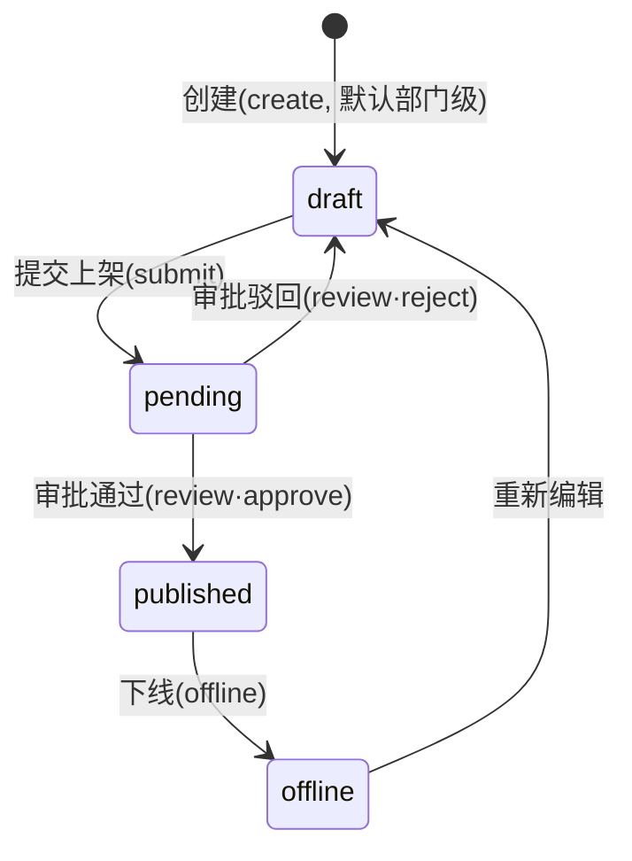

# ADR-007：权限模型与角色-权限矩阵（RBAC）

- 状态：**已采纳**（2026-07-20，Perry 拍板：补齐企业级上架审核流程，其余按起草建议）
- 对应任务：ROADMAP 2.3（权限模型：角色定义 + API 级校验方案）
- 决策人：Perry
- 起草：Claude
- 依赖：2.2（ADR-002，请求契约 `{userId, orgId, roles}`）、2.4（`user_roles` 表，C4 多角色）
- 契约来源：PRD 2.8 成员管理 + `tests/e2e/fixtures/test-data.ts` 的 `ROLE_MATRIX`（用例先行，本矩阵必须兼容）

---

## 背景

ADR-002 定了"你是谁、属于哪家公司、什么职位（`roles`）"如何传到每个请求。本 ADR 回答下一个问题：**拿着某个职位，到底能做哪些操作、不能做哪些**，以及**这套判断在哪里、怎么强制执行**。

数据隔离（能不能碰"别家公司"的数据）由 RLS 兜底（ADR-002），**已解决**。本 ADR 只管**功能权限**（能不能做"这个动作"），是 ADR-002 的应用层第一道防线，对应落地任务 3.4「权限校验中间件」。

---

## 决策

### 1. 模型：RBAC + 按操作鉴权 + 默认拒绝

- 采用 **RBAC（基于角色的访问控制）**：权限不直接绑用户，而是绑「角色」，用户通过 `user_roles` 拿到角色。
- 鉴权粒度 = **操作（action）**，用命名空间字符串表示，如 `agent:create`、`agent:review`、`member:manage`。API 每个受保护动作声明它需要的 action。
- **默认拒绝（deny-by-default）**：矩阵里没写 `允许` 的，一律 403。新增功能必须显式进矩阵，漏配 = 拒绝（安全侧默认）。
- **多角色取并集**（C4）：一个用户可有多个角色（如同时是 Developer 和 Auditor），有效权限 = 各角色权限的**并集**（任一角色允许即允许）。

### 2. 四个角色（PRD 2.8，组织内 org-scoped）

| 角色 | 定位 | 一句话 |
|------|------|--------|
| **Admin** | 管理员 | 本租户内完全权限（含成员、审核、MCP 审批、配额查看） |
| **Developer** | 开发者 | 创建和管理 AI 资产（Agent/Skill/知识库/Workflow），但**不能审核、不能管成员** |
| **User** | 普通用户 | 只**使用**已发布的 AI 服务（对话、跑工作流、传文件），不创建资产 |
| **Auditor** | 审计员 | **只读 + 审核**：看全部资产、审批/驳回、读审计日志，但不创建不修改 |

> **跨租户的"平台超级管理员"**（SaaS 运营方开通企业、调整他人配额、暂停租户，PRD 2.9）**不在这 4 个组织内角色里**，是独立的平台级角色（`tenant:manage`）。MVP 冲刺中 D3·D-2（4.5.1 成员/4.5.2 租户）先按"Admin 管理本租户"实现，跨租户运营超管留到阶段 6，见 §5。

#### 2.1 PRD 业务角色 ↔ 4 个技术角色映射

PRD 1.2 用业务语言描述了 4 类用户，落到数据模型的 `user_roles` 就是这 4 个技术角色：

| PRD 业务角色（1.2） | 技术角色 | 说明 |
|--------------------|---------|------|
| 企业 IT 管理员 | **Admin** | 平台运维、审批、企业级资产创建、成员/配额管理 |
| AI 开发者/使用者 | **Developer** | 创建 Agent/Skill/Workflow（部门级），提交上架审核 |
| 普通使用者 | **User** | 只使用已发布资产 |
| —（安全/审计岗） | **Auditor** | 只读 + 审核（PRD 2.6 安全审核模块的执行者） |
| 业务部门 AIBP（部门负责人） | **协同审批人**（见 §2.2） | 非独立技术角色；由 Admin 在上架审核时**指派**具 `*:review` 权限的用户协同审批 |

#### 2.2 统一上架审核流程（Agent / Skill / Workflow·Chatflow 三类资产，含企业级）

PRD 硬要求（2.3 Skill Hub、2.6 安全审核）：**资产上架必须"创建者申请 → 审批通过"**，不能自己发布自己。本流程对 **Agent、Skill、Workflow/Chatflow 三类资产统一适用**，企业级资产审批更严。

**状态机**（与 `test-data.ts` STATE_MACHINE、PRD 2.2.1 一致）：

**资产范围（scope）与审批门槛**：每类资产带 `scope ∈ {department 部门级, enterprise 企业级}`（PRD 1.2④：企业级 skill/agent 创建是平台管理员职责）。

| 环节 | 部门级资产 | 企业级资产 |
|------|-----------|-----------|
| 创建/转为该范围 | Developer / Admin（`*:create`） | **仅 Admin**（`*:create:enterprise`，Developer 不能直接产出企业级） |
| 提交上架（submit） | 创建者本人（Developer/Admin） | 创建者本人（Admin） |
| 审批（review） | Admin **或** Auditor 单审即可 | **Admin 必审**；Admin 可按需**指派业务部门 AIBP 协同审批**（`*:review:cooperate`），双签通过才上架（PRD 2.3：必要时增业务部门 AIBP 协同） |
| 上架目标 | 本部门可见 | Skill Hub / 全企业可见 |

**要点**：
- 三类资产共用同一套 `submit`/`review` 动作与状态机，只是 `scope` 决定审批人数与可见范围——**一套流程，参数化企业级**。
- **协同审批（AIBP）**：MVP 里 AIBP = Admin 从"持 `*:review` 权限的用户"中临时指派的第二审批人；其"部门绑定"依赖组织架构（切片 5），当前 `department` 是文本字段（C1），故首版**协同审批人由 Admin 手动指派**，部门自动路由留切片 5。
- 审核动作、驳回理由、双签记录一律写 `audit_logs`（PRD 2.6 审核历史）。

### 3. 角色-权限矩阵（本 ADR 的核心交付物）

✅=允许　❌=拒绝(403)。"own"=仅限本人创建的资源（应用层附加归属校验）。

| 模块 | 操作(action) | Admin | Developer | User | Auditor |
|------|-------------|:-----:|:---------:|:----:|:-------:|
| **Agent** | `agent:create` 创建(部门级) | ✅ | ✅ | ❌ | ❌ |
| | `agent:create:enterprise` 创建企业级 | ✅ | ❌ | ❌ | ❌ |
| | `agent:read` 查看 | ✅ | ✅ | ✅ 仅已发布 | ✅ |
| | `agent:update` 编辑 | ✅ | ✅ own | ❌ | ❌ |
| | `agent:delete` 删除 | ✅ | ✅ own | ❌ | ❌ |
| | `agent:submit` 提交上架审核 | ✅ | ✅ | ❌ | ❌ |
| | `agent:review` 审批批/驳(部门级单审) | ✅ | ❌ | ❌ | ✅ |
| | `agent:review:cooperate` 企业级协同审批 | ✅ 指派后 | ❌ | ❌ | ✅ 指派后 |
| | `agent:chat` 使用对话 | ✅ | ✅ | ✅ | ❌ |
| **Skill** | `skill:create` 创建(部门级) | ✅ | ✅ | ❌ | ❌ |
| | `skill:create:enterprise` 创建企业级 | ✅ | ❌ | ❌ | ❌ |
| | `skill:read` 查看 | ✅ | ✅ | ✅ 仅已发布 | ✅ |
| | `skill:update` / `skill:delete` | ✅ | ✅ own | ❌ | ❌ |
| | `skill:install` 安装 | ✅ | ✅ | ❌ | ❌ |
| | `skill:submit` 提交上架审核 | ✅ | ✅ | ❌ | ❌ |
| | `skill:review` 审批(部门级单审) | ✅ | ❌ | ❌ | ✅ |
| | `skill:review:cooperate` 企业级/上架Hub协同审批(AIBP) | ✅ 指派后 | ❌ | ❌ | ✅ 指派后 |
| | `skill:test` 试跑 | ✅ | ✅ | ❌ | ❌ |
| **知识库** | `kb:create` / `kb:update` / `kb:delete` / `kb:upload` | ✅ | ✅ own | ❌ | ❌ |
| | `kb:read` 查看 | ✅ | ✅ | ❌ 经 Agent 间接 | ✅ |
| **Workflow ·Chatflow** | `workflow:create`/`update`/`delete`(部门级) | ✅ | ✅ own | ❌ | ❌ |
| | `workflow:create:enterprise` 创建企业级/跨部门 | ✅ | ❌ | ❌ | ❌ |
| | `workflow:read` 查看 | ✅ | ✅ | ✅ 仅已发布 | ✅ |
| | `workflow:run` 运行 | ✅ | ✅ | ✅ 仅已发布 | ❌ |
| | `workflow:submit` 提交上架审核 | ✅ | ✅ | ❌ | ❌ |
| | `workflow:review` 审批(部门级单审) | ✅ | ❌ | ❌ | ✅ |
| | `workflow:review:cooperate` 企业级协同审批 | ✅ 指派后 | ❌ | ❌ | ✅ 指派后 |
| **MCP** | `mcp:register` 注册申请 | ✅ | ✅ | ❌ | ❌ |
| | `mcp:approve` 审批 | ✅ | ❌ | ❌ | ❌ |
| | `mcp:read` 清单(权限过滤后) | ✅ | ✅ | ❌ | ✅ |
| | `mcp:toggle` 启停 | ✅ | ❌ | ❌ | ❌ |
| **成员** | `member:read` 查看 | ✅ | ✅ | ❌ | ✅ |
| | `member:manage` 邀请/改角色/启禁/删除 | ✅ | ❌ | ❌ | ❌ |
| **审计** | `audit:read` 读审计日志 | ✅ | ❌ | ❌ | ✅ |
| **文件** | `file:process` 上传处理下载 | ✅ | ✅ | ✅ | ❌ |
| **会话** | `conversation:own` 读写自己的会话 | ✅ | ✅ | ✅ | ✅ |
| **租户** | `tenant:read` 本租户配额/账单 | ✅ | ❌ | ❌ | ✅ |
| | `tenant:manage` 跨租户开通/配额/暂停 | ❌ 平台超管专属(§5) | ❌ | ❌ | ❌ |

**与 `ROLE_MATRIX` 契约的一致性核对**（11 条测试断言全部满足）：

| 契约断言 | 本矩阵 |
|---------|--------|
| Admin agent:create/review/member:manage = ✅ | ✅✅✅ 一致 |
| Developer agent:create ✅ / review ❌ / member:manage ❌ | 一致 |
| User agent:create ❌ / agent:chat ✅ | 一致 |
| Auditor agent:review ✅ / agent:create ❌ / audit:read ✅ | 一致 |

### 4. 强制执行方案（API 级，落地任务 3.4）

- **执行点**：Next.js API Route / Server Action 入口的**权限中间件**，读 ADR-002 注入的 `ctx.roles`，调 `requirePermission(ctx, 'agent:create')`，不满足直接 403。**绝不只靠前端隐藏菜单**（隐藏菜单只是体验，不是安全）。
- **权限映射单一数据源**：`lib/auth/permissions.ts` 导出 `ROLE_PERMISSIONS: Record<Role, Set<Action>>`（就是上表的代码化），中间件与 `ROLE_MATRIX` 测试共用同一张表，避免"文档一套、代码一套"。
- **两类校验分工**：
  - *动作权限*（能不能做这个动作）→ 本矩阵，中间件判。
  - *数据归属 own*（能不能改这条具体数据）→ 应用层查 `created_by == userId`（或 Admin 放行）；跨租户由 RLS 兜底（ADR-002）。
- **"已发布才可见"**：User 的 `*:read` 限已发布资产，通过 `where status='published'` 实现，不进权限矩阵（那是数据过滤，不是动作权限）。
- **审计**：所有 403 拒绝与敏感动作（review/member:manage/mcp:approve）写 `audit_logs`。

### 5. 平台超级管理员（跨租户，暂缓）

`tenant:manage`（开通企业、改他人配额、暂停租户）是 SaaS 运营方的能力，跨越 `org_id` 边界，**与 RLS 的租户隔离天然冲突**，必须用 service 客户端 + 独立超管鉴权，风险面完全不同。本 ADR **不把它塞进 4 个组织内角色**。MVP 冲刺 D3·D-2 的 4.5.x 先做"Admin 在本租户内邀请成员/查看配额"，真正的跨租户运营后台留阶段 6，届时新增 `platform_admin` 角色专题（可能独立鉴权体系）。

---

## 已拍板结论（2026-07-20 Perry 确认）

1. **Auditor 不能使用对话（`agent:chat`=❌）**：审计员定位"纯只读+审核"，不作为消费者。✅ 采纳。
2. **发布必须走审核**：三类资产（Agent/Skill/Workflow·Chatflow）统一走"创建者 `submit` → Admin/Auditor `review`"，开发者不能自己发布自己的资产；**企业级资产**创建仅 Admin、审批 Admin 必审 + 可指派 AIBP 协同双签（见 §2.2）。✅ 采纳并按 PRD 补齐企业级流程。
3. **平台超管 `tenant:manage` 暂缓到阶段 6**（见 §5），MVP 里租户/成员管理按"Admin 管本租户"实现。✅ 采纳。

---

## 被否决的备选

| 方案 | 否决原因 |
|------|---------|
| 直接在数据库 RLS 里做角色细粒度控制 | RLS 擅长按 `org_id` 过滤"数据可见性"，做"动作权限"会让策略爆炸且难测；migration 0001 已注明角色控制放应用层 |
| 前端按角色隐藏菜单即可 | 隐藏 ≠ 安全，构造请求即可绕过；必须服务端强制 |
| 给每个用户单独配权限（ACL） | 企业场景角色稳定，ACL 维护成本高、不可预测；RBAC 足够且可测 |
| 单角色（用户只能一个角色） | 与数据模型 C4 多角色冲突，且现实中"开发者兼审计"存在；用并集 |

## 连带决定与落地清单

- 新建 `lib/auth/permissions.ts`（`Role`/`Action` 类型 + `ROLE_PERMISSIONS` 表 + `hasPermission()`）——3.4 落地，A/相关道建。
- 新建 `requirePermission()` 中间件包裹受保护 API——3.4。
- `ROLE_MATRIX`（test-data.ts）在 3.7 隔离/权限专项里逐条断言（对应 S0 权限组用例）；**并扩展补入企业级流程断言**：`*:create:enterprise`（仅 Admin）、`*:submit`/`*:review` 三资产统一、`*:review:cooperate`（AIBP 协同双签）——交 C 测试道随 3.7 补。
- 本矩阵是**动作权限单一事实来源**：新增任何写操作 API，必须先在矩阵登记 action，再实现（否则默认拒绝）——写入 CLAUDE.md 约定。

## 复审条件

- 引入平台超管 / 跨租户运营后台时（阶段 6）重开，新增 `platform_admin`。
- 出现"部门级权限"（PRD 提到 MCP 按部门过滤）需求扩展时：当前 `department` 是文本字段（C1），升级组织架构（切片 5）后可能引入"角色×部门"二维权限，届时本 ADR 增补。
